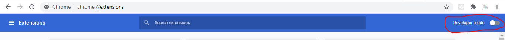
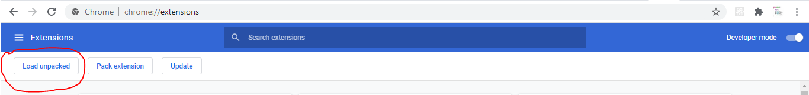
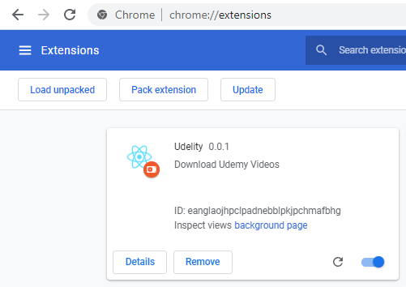

## How to install Udelity Extension?

1. Extract the **udelity-extension.zip** file.

2. Open Chrome and type url *[chrome://extensions](chrome://extensions)*

   

3. On the Developer mode by clicking it(right top side).

   

4. Click on Load unpacked.

   

5. Select the location where you have extracted the **udelity-extension.zip** file. After that it will look like

   
